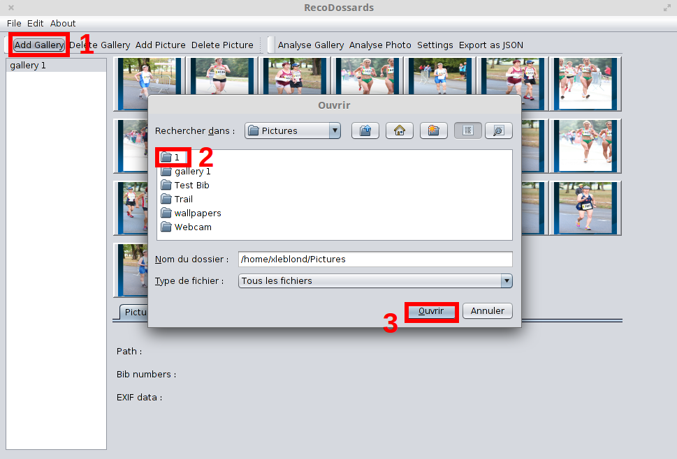

# User guide

## Introduction
RecoDossard recognize number of bibs on pictures. This application is composed of 2 interfaces : one in command line and one graphic. 
This document is for people who want to use RecoDossard application. It explains how to use the software.

## 1. General informations

### 1.1. Goal

The goal of RecoDossard is to recognize number of bibs in a picture and to display it.

### 1.2. Configuration

RecoDossard works on Mac OS, Microsoft Windows and Linux.

### 1.3. Licence

RecoDossard can be download, use and update freely. It is an open source software published under CECILL licence.

### 1.4. Library
 - [Apache Commons CLI 1.3.1](https://commons.apache.org/proper/commons-cli/) -- Apache Licence, Version 2.0
 - [Apache POI 3.13](https://poi.apache.org) -- Apache Licence, Version 2.0
 - [Tess4J 2.0](http://tess4j.sourceforge.net/) -- Apache Licence, Version 2.0
 - [Tesseract 3.04](https://github.com/tesseract-ocr) -- Apache Version, Licence 2.0
 - [metadata-extractor 2.8.1](https://github.com/drewnoakes/metadata-extractor) -- Apache Licence, Version 2.0
 - [OpenCV 3.0](https://opencv.org) -- BSD Licence

## 2. Installation

### 2.1 Install native library

#### 2.1.1 Install OpenCV
RecoDossard is built with OpenCV 3.0. You can grab the latest version for your operating system on [this page](http://opencv.org/downloads.html).

##### OpenCV Java build
You can build OpenCV Java library from the source or download it from [this page](http://www.magicandlove.com/blog/2015/06/20/opencv-3-0-0-release-java-build/).

#### 2.1.2 Install Tesseract
RecoDossard has been tested with the 3.04 version of Tesseract. A lower version can work but nothing sure!
You can find some help on [this page](https://github.com/tesseract-ocr/tesseract/wiki) to install it according to your operating system.

##### Install Tesseract Java wrapper
1. Download [Tess4J 2.0](http://sourceforge.net/projects/tess4j/files/tess4j/2.0/)
2. Unzip file.
3. Copy/paste jar files in the RecoDossard executable directory.

### 2.3 Install third party Java libraries

#### 2.3.1 For console mode
1. Download [the Apache Commons CLI 1.3.1](http://apache.websitebeheerjd.nl//commons/cli/binaries/commons-cli-1.3.1-bin.zip).
2. Unzip file.
3. Copy/paste the ``commons-cli-1.3.1.jar`` file in the RecoDossard executable directory.

#### 2.3.2 To parse race data file (only xls)
1. Download [Apache POI 3.13](https://poi.apache.org/download.html#POI-3.13)
2. Unzip file.
3. Copy/paste jar files in the RecoDossatable executable directory.

#### 2.3.3 JSON Support
Download [JSON library](http://search.maven.org/remotecontent?filepath=javax/json/javax.json-api/1.0/javax.json-api-1.0.jar) and put it in the RecoDossard executable directory.

#### 2.3.4 Metadata image support
1. Download [metadata-extractor 2.8.1](https://github.com/drewnoakes/metadata-extractor/releases/tag/2.8.1).
2. Unzip file.
3. Copy/Paste ``metadata-extractor-2.8.1.jar`` and ``xmpcore-5.1.2.jar`` files in the RecoDossard executable directory.

## 3. Execute with console

### 3.1. Standard mode

Standard mode consist to enter in command line : 
`java Main <image file>`
`<image file>` is a file or directory to analyze.
To save the result in a file, enter in command line : 
`java Main <image file> <output file>`

### 3.2. -h and --help option

Options `[-h]` and `[--help]` give in details how to use the application and the different options.
To use these options, enter in command line : 
`java Main -h` or `java Main --help`

### 3.3. -v option

`-v` option is useful to have the detail of the recognition of bibs. 
To use it, enter in command line : 
`java Main -v <image file> [<outputfile>]`
Output file is optional, it depends if the OCR has to save the result in a file or not.

### 3.4. -d option

`-d` option save all the files generated by the OCR to identity a bib in a picture.
To use it, enter in command line : 
`java Main -d [-v] <image file> [<output file>]`
Output file is optional, it depends if the OCR has to save the result in a file or not.

### 3.5. -e option

`-e` option consist to specify to the OCR that it can use the EXIF data of the picture to have a better result.
To use it, enter in command line : 
`java Main -e [-d] [-v] <image file> [<output file>]`
Output file is optional, it depends if the OCR has to save the result in a file or not.

### 3.6. -rd option

`-rd` option consist to add the ranking file to have a better recognition. 
To use it, enter in command line : 
`java Main -rd [-e] [-d] [-v] <image file> [<output file>]`
Output file is optional, it depends if the OCR has to save the result in a file or not.

## 4. Graphical User Interface (GUI)

### 4.1. First opening 

When starting the application, there is no gallery. For adding a gallery, click on button "Add gallery" and select the directory wanted.

### 4.2. Add picture

Once we are in a gallery, we can add a picture at the gallery. To do that, we have to click on the button ``Add Picture``. A window  appear to select the files that we want to add in the gallery.

We can see the pictures added in the gallery. 

### 4.3. Delete picture

We can delete a picture once we have select one or several picture(s) in the gallery. After that, we have to click on the ``Delete Button``. Then pictures selected are delete of the gallery.

### 4.4. Detail of a picture

When we select a picture in the gallery, we have at the bottom of the window the detail of the picture selected. 

We can find the location in the computer of the picture and the bibs founded if the picture was already analyzed.

### 4.5. Analyze

There are two different possibilities of analysis : analysis of all the gallery or analysis of the pictures selected.
If we want to analyze all the gallery, we have to click on the button . 
If we want to analyze only some pictures, we have to select it and click on the button . 
Once we clicked on these button, a new window appear to select the options of the analysis.

In this window, we can add a ranking file, specify where the picture was taken and set the luminance of the picture. These options can improve the recognition of bibs.

### 4.6. Add a gallery

At the left top, there is a button to add a new gallery named ``Add gallery``. 

When we click on this button, a window appear to select the directory of the new gallery. 

After that, new gallery is added and if there was pictures in the directory, we can see pictures in the gallery at the center of the application. 

### 4.7. Delete a gallery
To delete a gallery, select a gallery on the left side, then click on the ``Delete Gallery`` button.

